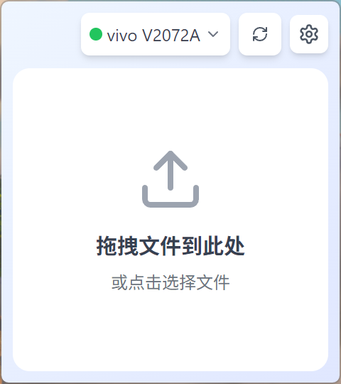
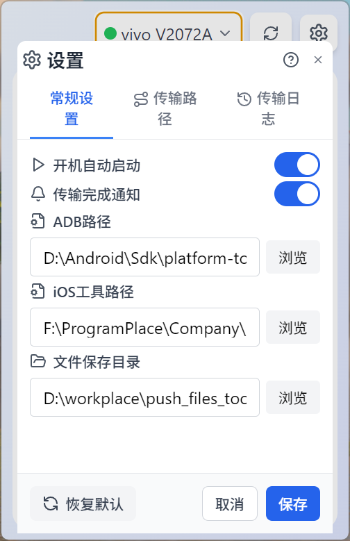
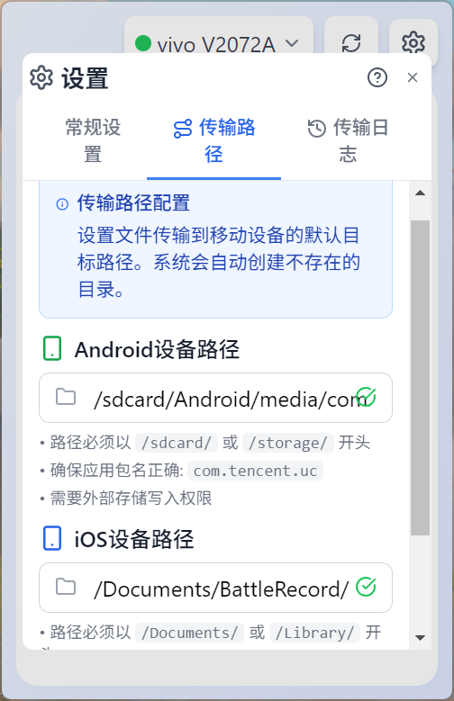

# 文件推送工具（files_push）需求说明规格书

## 1. 文档信息
- 文档版本：v1.1.0
- 编写日期：2025-11-15
- 适用范围：Windows 桌面端 Electron 应用（files_push）
- 读者对象：产品、研发、测试、运维

## 2. 概述
- 产品定位：将本地文件以稳定、可控的方式推送到已连接的 Android/iOS 设备指定目录，并在本地进行原子保存与完整日志记录。
- 目标价值：降低人工步骤与出错概率，提供统一路径管理、进度反馈与可追溯的日志统计。
- 运行环境：Windows 10+；USB 连接的 Android/iOS 设备；ADB、爱思 idb 可执行工具。

## 2.1 技术框架
- 桌面框架：`Electron 33`，采用 `contextBridge` + `ipcMain/ipcRenderer`，配置持久化使用 `electron-store`，打包使用 `electron-builder`。
- 前端框架：`React 18`、`TypeScript`、`Vite`、`Tailwind CSS`、状态管理 `zustand`。
- 预加载脚本：`electron/preload-simple.js` / `electron/preload.ts` 暴露 `electronAPI` 给渲染进程。
- 构建与质量：`tsc`、`eslint`、`vite-tsconfig-paths`、`concurrently`；开发模式加载 `http://localhost:5173`。
- 设备与通信：`ADB`（Android）、爱思 `idb`（iOS），应用目录内置可执行于 `src/adb` 与 `src/idb`。
- 传输/服务扩展：`express`、`multer`、`cors`、`react-dropzone` 等（按需要启用）。
- 打包与脚本：`electron-builder.json`、`build.bat`、`build-en.bat`、`clean-build.ps1`，支持中英双语打包脚本。

## 3. 术语与缩写
- ADB：Android Debug Bridge
- idb：爱思助手命令行工具
- 目标目录：设备端接收文件的目录
- 本地保存目录：成功传输后在本地保留副本的目录
- 原子保存：临时文件写入完成后一次性重命名为最终文件名

## 4. 用户与角色
- R1 普通用户：进行文件推送、查看进度与日志、配置基础项。
- R2 维护人员：处理工具路径与设备连接问题，导出日志用于排障。
- R3 开发人员：扩展功能与模块。

## 5. 范围与边界
- 支持平台：Android（ADB）、iOS（idb）。
- 支持系统：Windows 桌面端。
- 支持文件：普通文件类型（视频/图片/日志等）。
- 不包含：无线传输、设备端播放/后处理、Mac/Linux 支持。

## 6. 前置条件与依赖
- 必须安装并可执行的 ADB 与 idb（优先使用应用自带路径）。
- USB 连接正常，设备已授权/信任。
- 应用有磁盘写权限；目标目录存在或可创建。

## 7. 功能需求（FR）
- FR-001 设备发现与状态
  - 自动发现 Android/iOS 设备，显示设备名称、平台、在线状态。
  - 接收设备状态变更事件，实时更新列表。
- FR-002 工具可用性检查
  - 提供 `ADB` 与 `idb` 路径检查与版本验证；支持浏览选择与即时校验。
- FR-003 文件选择与拖拽
  - 支持拖拽文件到界面或通过文件选择器导入；支持批量选择。
  - 文件校验：大小上限（默认 500MB，可配置）、路径合法性、重复项处理。
- FR-004 目标目录管理
  - Android 默认：`/sdcard/Android/media/com.tencent.uc/BattleRecord/`。
  - iOS 默认：`/Documents/BattleRecord/`（BundleId=`com.tencent.uc`）。
  - 路径校验：前缀、非法字符、平台差异；标准化与自动补全；恢复默认。
- FR-005 推送执行与进度
  - iOS：容器解析（`-b com.tencent.uc`）、强校验远端文件存在与一致性。
  - 覆盖策略：重命名（默认避免覆盖）。
  - 进度显示：总进度、分片进度、速度估算与剩余时间。
- FR-006 并发与队列
  - 任务排队顺序执行（默认并发）。
  - 可取消/清空队列；失败任务，推送历史记录页面支持重试和再次推送。
- FR-007 本地保存与原子性
  - 本地保存成功文件副本（默认 `D:\\workplace\\push_files_tool_temp`），保留时间戳。
  - 原子保存：临时文件写入完成后重命名；冲突命名追加序号或哈希。
- FR-008 设置管理
  - 设置项：ADB 路径、idb 路径、Android/iOS 目标目录、本地保存目录、BundleId、并发与大小上限、通知开关。
  - 支持导入/导出 JSON 设置；一键恢复默认。
- FR-009 日志与统计
  - 记录时间、设备、文件名、大小、耗时、结果、错误信息。
  - 统计视图：总量、成功率、按平台分布、最近记录；支持清理与导出（CSV/JSON）。
- FR-010 通知与错误处理
  - 桌面通知：成功/失败、设备连接变化。
  - 错误分类与提示：网络/设备/权限/空间不足/路径不存在等；支持重试策略。
- FR-011 帮助与指引
  - 帮助页/弹窗：安装与验证步骤、连接指引、常见问题与注意事项。
## 8. UI设计风格参考

## 9. 交互与UI样式规范
- 主界面：设备选择器（列表与状态）、拖拽区域与文件选择、目标路径选择队列、操作区（清空队列/查看日志/设置/帮助）。
- 设置界面：工具路径输入与浏览、目录设置、BundleId、并发与大小上限、消息消失时间、目标路径队列编辑。
- 路径设置：支持添加/删除/编辑目标路径；队列顺序影响展示顺序;adb工具路径、爱思idb工具路径。
- 日志界面：列表与筛选、导出与清理。
- 帮助界面：安装与验证、连接指引、常见问题。
- 页面背景使用 `bg-white`，容器内边距 `p-2`
- 标题容器添加 `electron-drag`，交互控件使用 `electron-no-drag`
- 信息面板采用 `bg-gray-50 p-2 rounded-md text-sm`
- 布局建议 `w-full h-full`，高度控制 `max-h-[80vh]` 或滚动
- 帮助窗口由 `open-help` 打开，路由 `#/help`

## 10. 业务流程
- 推送流程：选择设备 →选择路径 → 选择/拖拽文件 → 校验与入队 → 分平台推送 → 进度展示 → 结果记录与本地保存 → 通知与统计更新。
- 设备检测：启动 → 工具检查 → 设备轮询 → 列表展示与状态更新。
- 路径管理：初始化默认 → 用户修改 → 校验与标准化 → 持久化保存。

## 11. 接口与IPC（主/渲染进程）
- 设备相关：`get-devices`、`device-status-changed`、`check-adb`、`check-ios-tools`、`get-idb-path`。
- 推送与进度：`push-file`、`onTransferProgress`、`materialize-file`。
- 路径与设置：`get-settings`、`update-settings`、`reset-settings`、`get-transfer-paths`、`update-transfer-paths`、`validate-transfer-path`、`validate-path`、`get-save-dir`。
- 日志与统计：`get-transfer-log`、`clear-transfer-log`、`get-transfer-stats`。
- 本地保存：`save-local-file`。

## 12. 数据与存储
- 设置：`electron-store` 持久化 JSON（包名、工具路径、目标目录、BundleId、传送记录、设置）。
- 日志：时间、设备信息、文件信息、大小、传送开始时间、传送结束时间、耗时、结果、错误码/信息；支持导出。
- 统计：总量、成功率、平台分布、最近 N 条（动态计算或缓存）。
- 临时文件：采用原子保存策略，冲突命名追加序号或哈希。

## 13. 校验与错误处理
- 前置校验：工具路径存在与可执行、设备在线、目标目录合法。
- 运行时错误：断连/空间不足/权限/路径不存在；提供重试与可读提示。
- 回滚与清理：清理临时文件、记录失败日志、保持状态一致。

## 14. 性能指标
- 典型 200MB 文件在稳定连接下以合理速度完成（受设备与线缆限制）。
- 进度更新频率合理，避免过度影响性能。

## 15. 安全与合规
- 不收集隐私数据，不进行外网传输。
- 日志隐私保护，避免泄露敏感路径与数据。
- 遵循 Windows 安全策略与磁盘权限要求。

## 16. 兼容性与依赖
- 依赖：ADB、idb（优先使用应用自带路径）。
- Windows 环境变量与路径分隔兼容；设备端路径差异处理与容器解析（iOS）。

## 17. 测试计划
- 单元测试：路径校验、设置读写、命名冲突策略、日志/统计计算。
- 集成测试：设备发现与状态更新、推送大文件、分片与合并。
- UI 测试：拖拽与选择、进度显示、错误提示、设置校验。
- 性能测试：不同大小文件、分片大小与并发、断连与恢复。
- 回归测试：版本升级后设置与日志兼容性。

## 18. 验收标准
- 设备正常时稳定推送指定大小文件到默认目录；成功率达到预期。
- 进度、日志与统计准确无误；错误信息清晰可读。
- 设置项可用且校验严格；工具检测正确；本地保存原子性与冲突策略符合预期。

## 19. 部署与运维
- 开发：`npm run dev` 启动 Vite+Electron；预加载与主进程加载本地开发地址。
- 构建：`npm run build`；产物可由 `electron-builder` 生成安装包（`npm run dist`）。
- 运维：日志导出用于定位问题；提供工具路径与设备连接的故障排除指南。

## 20. 风险与边界
- 风险：设备端权限与路径差异、idb 版本兼容性、极端大文件导致性能波动。
- 边界：不提供无线推送，不管理设备端后处理，不支持 Mac/Linux。

---

> 注：默认配置参考 Electron 主进程与 `electron-store` 设置：本地保存目录默认 `D:\\workplace\\push_files_tool_temp`，iOS 需要解析 BundleId（默认 `com.tencent.uc`）。
